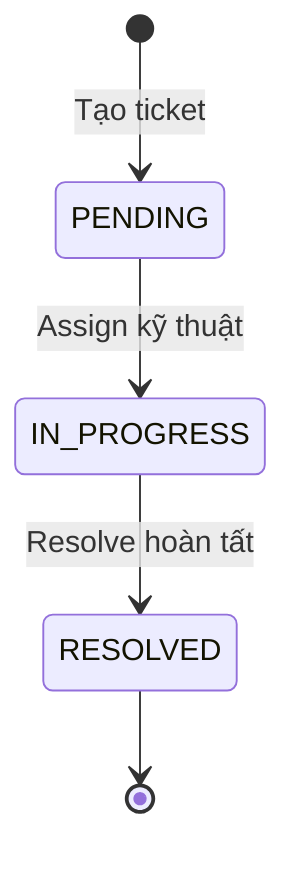
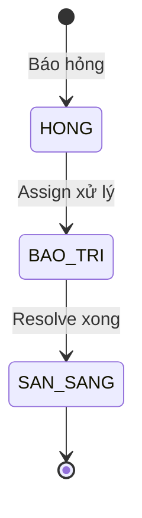

# Flowchart nghiệp vụ báo hỏng - xử lý - hoàn tất

```mermaid
flowchart TD
    A[Người dùng quét QR thiết bị] --> B[Frontend parse qa_code]
    B --> C[GET /api/assets/{qaCode}]
    C --> D{Thiết bị tồn tại?}
    D -- Không --> D1[Hiển thị lỗi và dừng]
    D -- Có --> E[Nhập mô tả lỗi + ảnh]
    E --> F[POST /api/tickets]
    F --> G[Tạo Ticket status=PENDING]
    G --> H[Cập nhật Asset status=Hỏng]
    H --> I[Lưu notifications sự kiện tạo ticket]
    I --> J[Hiển thị ticket cho bộ phận kỹ thuật]

    J --> K[Trao đổi qua Chat]
    K --> K1[POST /api/tickets/{ticketId}/chats]
    K1 --> K2[Lưu chat_messages]
    K2 --> K3[Realtime broadcast /topic/tickets/{ticketId}]
    K3 --> K4[Push chat notification theo user]
    K4 --> L{Đã phân công xử lý?}

    L -- Chưa --> M[PUT /api/tickets/{id}/assign]
    M --> N[Ticket: PENDING -> IN_PROGRESS]
    N --> O[Asset: Hỏng -> Bảo trì]
    O --> P[Lưu notifications sự kiện assign]

    L -- Đã phân công --> Q[Tiếp tục chat cập nhật tiến độ]
    P --> Q
    Q --> R{Khắc phục xong?}
    R -- Chưa --> Q
    R -- Rồi --> S[PUT /api/tickets/{id}/resolve]
    S --> T[Ticket: IN_PROGRESS -> RESOLVED]
    T --> U[Set resolvedAt]
    U --> V[Asset: Bảo trì -> Sẵn sàng]
    V --> W[Lưu notifications sự kiện resolve]

    W --> X[Lịch sử sửa chữa/timeline]
    X --> X1[Timeline sửa chữa từ danh sách ticket theo asset_qa_code]
    X1 --> X2[Timeline realtime từ notifications feed]
    X2 --> Y[Kết thúc nghiệp vụ]
```

## Trạng thái chính trong luồng




