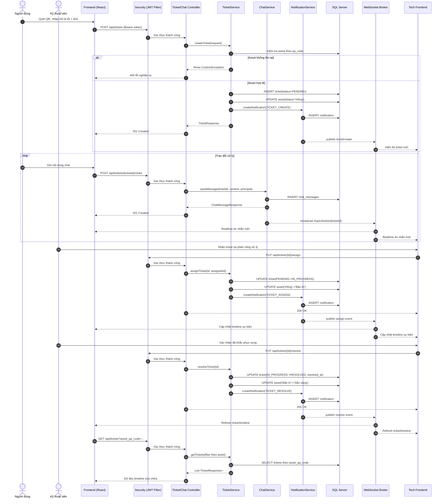

# Sequence Diagram nghiệp vụ báo hỏng

```mermaid
sequenceDiagram
    autonumber
    actor U as Người dùng
    actor T as Kỹ thuật viên
    participant FE as Frontend (React)
    participant SEC as Security (JWT Filter)
    participant API as Ticket/Chat Controller
    participant TS as TicketService
    participant CS as ChatService
    participant NS as NotificationService
    participant DB as SQL Server
    participant WS as WebSocket Broker
    participant TF as Tech Frontend

    U->>FE: Quét QR, nhập mô tả lỗi + ảnh
    FE->>SEC: POST /api/tickets (Bearer token)
    SEC->>API: Xác thực thành công
    API->>TS: createTicket(request)
    TS->>DB: Kiểm tra asset theo qa_code
    alt Asset không tồn tại
        TS-->>API: throw CustomException
        API-->>FE: 400 lỗi nghiệp vụ
    else Asset hợp lệ
        TS->>DB: INSERT ticket(status=PENDING)
        TS->>DB: UPDATE asset(status='Hỏng')
        TS->>NS: createNotification(TICKET_CREATE)
        NS->>DB: INSERT notification
        TS-->>API: TicketResponse
        API-->>FE: 201 Created
        NS-->>WS: publish ticket/create
        WS-->>TF: Hiển thị ticket mới
    end

    loop Trao đổi xử lý
        U->>FE: Gửi nội dung chat
        FE->>SEC: POST /api/tickets/{ticketId}/chats
        SEC->>API: Xác thực thành công
        API->>CS: saveMessage(ticketId, content, principal)
        CS->>DB: INSERT chat_messages
        CS-->>API: ChatMessageResponse
        API-->>FE: 201 Created
        CS-->>WS: broadcast /topic/tickets/{ticketId}
        WS-->>FE: Realtime tin nhắn mới
        WS-->>TF: Realtime tin nhắn mới
    end

    T->>TF: Nhận ticket và phân công xử lý
    TF->>SEC: PUT /api/tickets/{id}/assign
    SEC->>API: Xác thực thành công
    API->>TS: assignTicket(id, assigneeId)
    TS->>DB: UPDATE ticket(PENDING->IN_PROGRESS)
    TS->>DB: UPDATE asset('Hỏng'->'Bảo trì')
    TS->>NS: createNotification(TICKET_ASSIGN)
    NS->>DB: INSERT notification
    API-->>TF: 200 OK
    NS-->>WS: publish assign event
    WS-->>FE: Cập nhật timeline sự kiện
    WS-->>TF: Cập nhật timeline sự kiện

    T->>TF: Xác nhận đã khắc phục xong
    TF->>SEC: PUT /api/tickets/{id}/resolve
    SEC->>API: Xác thực thành công
    API->>TS: resolveTicket(id)
    TS->>DB: UPDATE ticket(IN_PROGRESS->RESOLVED, resolved_at)
    TS->>DB: UPDATE asset('Bảo trì'->'Sẵn sàng')
    TS->>NS: createNotification(TICKET_RESOLVE)
    NS->>DB: INSERT notification
    API-->>TF: 200 OK
    NS-->>WS: publish resolve event
    WS-->>FE: Refresh ticket/timeline
    WS-->>TF: Refresh ticket/timeline

    FE->>SEC: GET /api/tickets?asset_qa_code=...
    SEC->>API: Xác thực thành công
    API->>TS: getTickets(filter theo asset)
    TS->>DB: SELECT tickets theo asset_qa_code
    TS-->>API: List<TicketResponse>
    API-->>FE: Dữ liệu timeline sửa chữa
```
